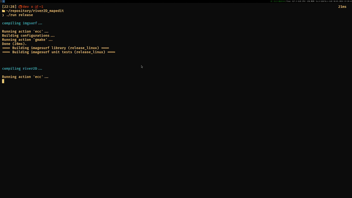

# The river2D map editor!

a preview:

## current state

since I am currently working on a fairly small game (16x16 tiles on a 360p base canvas), the abilities of the editor reflect that right now.
but, you can:

- open the editor and start placing tiles
- to load tiles, you must place your tilesheet in `assets/tiles/tilesheet.qoi`.
- `q` from the main menu will quit the editor
- `escape` will bring up the main menu
- `t` from the editor will toggle the tile selection menu
- `1` through `4` will switch the layer you can place onto

## known issues / future plans
- scaling does not work correctly, unless the base canvas resolution is set to 640x360p.
- the tilesize is hardcoded to `16x16` (for now).
- you can't save or load your projects, yet.
- the cursor is not changing on windows, yet.
